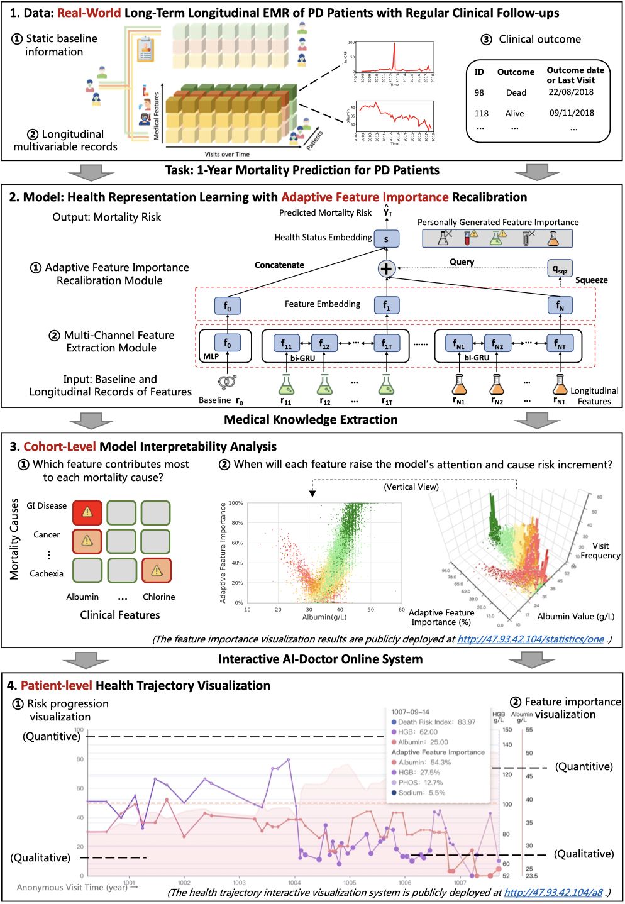
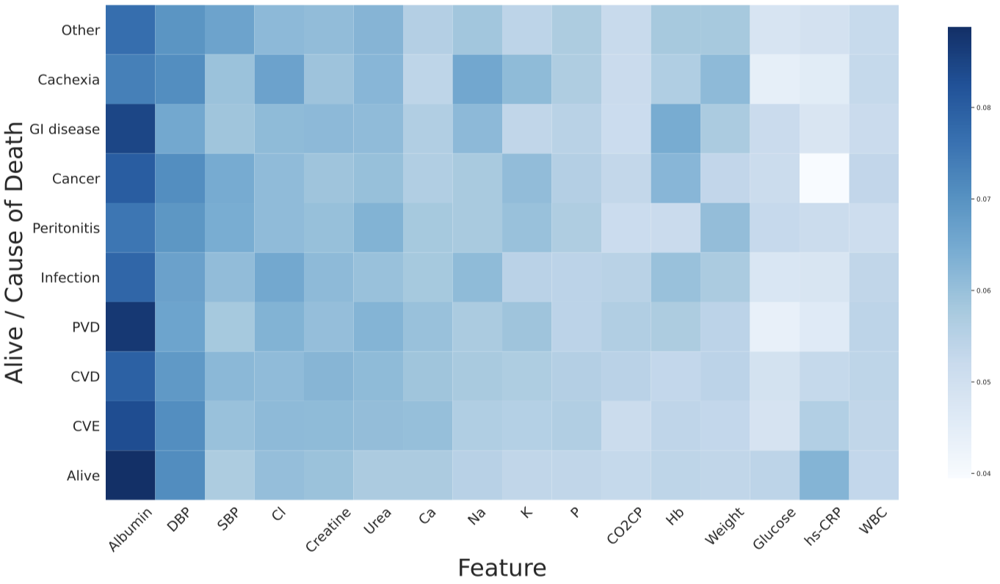
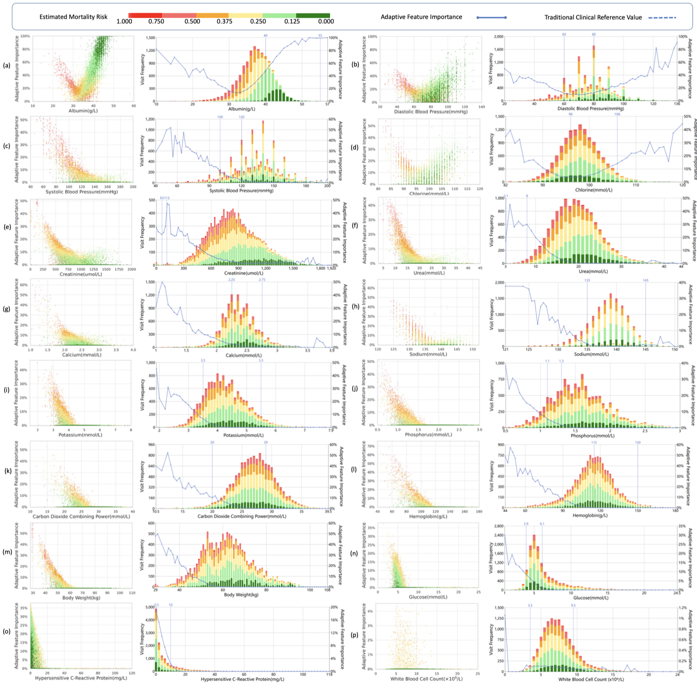

# AICare
The source code for paper *Mortality Prediction with Adaptive Feature Importance Recalibration for Peritoneal Dialysis Patients: a retrospective study on a real-world longitudinal follow-up dataset*

Thanks for interest in our work.

## Overview

#### Mortality Prediction Research Overview for peritoneal dialysis (PD) Patients.

- We collect an over **12-year**, **long-term**, and **real-world** clinical EMR dataset of PD patients, consisting of static baseline information, longitudinal multi-variable records and clinical outcomes. The prediction task is defined as a 1-year mortality prediction at each clinical visit.  
- We propose a deep-learning-based interpretable health status representation learning framework, consisting of a multi-channel feature extraction module and an adaptive feature importance recalibration module. 
- We perform the model interpretability analysis for diverse mortality causes and observe the change of feature importance to extract novel medical knowledge (taking albumin as an example). 
- We build an interactive AI-Doctor system to visualize the health trajectory.

### Objective

The whole procedure of the peritoneal dialysis (PD) treatment for end-stage renal disease (ESRD) patients needs a dynamic mortality risk prediction to help patients recover smoothly and prevent adverse outcomes, based on the longitudinal electronic medical records (EMR) collected along with the follow-up visits.This cross-disciplinary research is to develop a deep-learning-based model, AICare, capable of learning massive EMR data and exploring personal characteristics to perform real-time, individualized and interpretable mortality prediction.

### Method

Our proposed end-to-end model consists of a multi-channel feature extraction module and an adaptive feature importance recalibration module. Both dynamic records and static features are embedded together to get a comprehensive health status representation from an overall perspective.AICare explicitly identifies the key features that strongly indicate the outcome prediction for each patient to build the health status embedding individually.It provides reasonable fine-grained interpretability in terms of feature importance at each follow-up visit and analyzes the changes of feature importance with its values to provide medical recommendations.

### Materials

This study has collected 13,091 clinical follow-up visits and demographic data of 656 PD patients from Peking University Third Hospital, covering more than 12 years.To verify the application universality of AICare on other patient cohorts, we also introduce an additional experiment dataset to test the prediction performance, which consists of 1,363 ESRD patients receiving hemodialysis dialysis (HD) from Peking University People's Hospital.

### Results and Conclusion

To summarize:

1) Experiment results show that AICare models the patient's health status and achieves better performance compared to the state-of-the-art models in terms of mortality prediction performance while simultaneously providing qualitative interpretability on ESRD datasets.
2) This study first provides a comprehensive elucidation of the relationship between the causes of mortality in patients with PD and clinical features based on an end-to-end deep learning model. 
3) This study first reveals the pattern of variation in the importance of each feature in the mortality prediction and provides recommended reference value for most PD patients based on ante-hoc interpretability, without any injection of human physicians' knowledge. 
4) To further foster personalized clinical service, we develop a practical AI-Doctor interaction system to visualize the trajectory of patients' health status and risk indicators.

### AI-Doctor Interaction Online System 

Our health trajectory visualization system with anonymous case studies (patient ID from A1 to A20) is publicly available at http://47.93.42.104/A8. 
Visualization of the importance of the features is available at http://47.93.42.104/statistics/one. 
We release our code at https://github.com/Accountable-Machine-Intelligence/AICare.
Users can upload the data online to get the prediction results immediately or download the code to train the model based on their dataset offline.

### Implications

#### Average Feature Importance Heatmap for Diverse Mortality Causes Generated by AICare.

 The **darker** the color, the greater the importance. 

- Serum albumin is the most important feature in mortality prediction, especially for peritoneal dialysis (PD) patients who died of gastrointestinal (GI) disease and peripheral vascular disease (PVD). 

- Diastolic blood pressure (DBP) is the second indicative feature, especially for PD patients who died of cachexia, cancer and cerebrovascular disease (CVE).

- Come with the paper for more details.

  #### Average Feature Importance Variation Learned by AICare along with Feature Values.

  

  

  The clinical visits are marked as colored dots and histograms. Red represents **high risk** predicted by AICare, while green represents **low risk**.  The average feature importance is visualized as blue fold lines. 
  The traditional clinical reference values are vertically marked as blue dotted lines. 
  There are two variation patterns of feature importance, **V-shaped parabolic curves** (e.g., albumin, diastolic blood pressure) and **L-shaped fold lines** (e.g., systolic blood pressure, hemoglobin). 

  1) We take the serum albumin's importance variation as an example of a **V-shaped** parabolic curve. For most patients, when albumin is lower (higher) than the turning point of 32 g/L, the more extreme the value is, the more attention weight is assigned by AICare, which means this feature takes essential parts in health status representation learning, and meanwhile the predicted mortality risk rises (declines). As a result, AICare recommends improving the serum albumin to above 32 g/L, the higher the better.
  2) On the contrary, we take the systolic blood pressure's (SBP) importance variation as an example of an **L-shaped** fold line. For most patients, when SBP is lower than the turning point of 130 mmHg, the lower the value is, the more attention weight is assigned. However, when SBP is higher than 130 mmHg, the attention weight drops to nearly 0,  meaning this feature will no longer affect the health status representation learning. As a result, AICare recommends improving the SBP to above or near 130 mmHg, but higher will not be beneficial.

  The visualization results above are publicly deployed at http://47.93.42.104/statistics/one. Come with the paper for more details.

#### Case study

For more case studies, please visit:

​	http://47.93.42.104/A1
​	http://47.93.42.104/A2
​	http://47.93.42.104/A3
​	http://47.93.42.104/A4
​	http://47.93.42.104/A5
​	http://47.93.42.104/A6
​	http://47.93.42.104/A7
​	http://47.93.42.104/A8
​	http://47.93.42.104/A9
​	http://47.93.42.104/A10

### Requirements

* Install python, pytorch. We use Python 3.7.3, Pytorch 1.5.1.
* If you plan to use GPU computation, install CUDA

